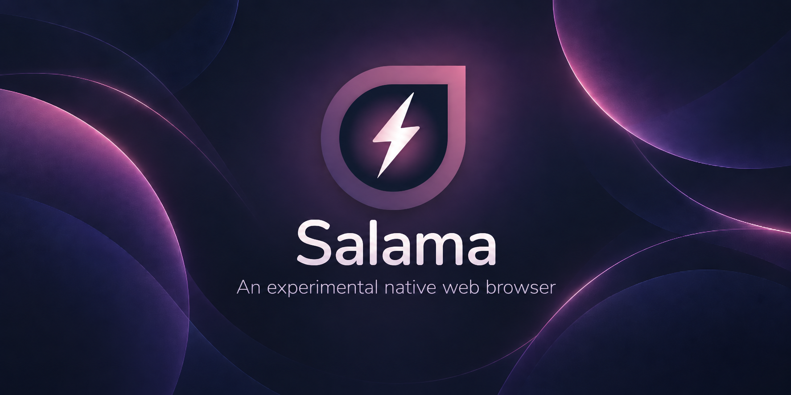

# Salama



[](https://sonarcloud.io/summary/new_code?id=muhnschein_salama)[](https://sonarcloud.io/summary/new_code?id=muhnschein_salama)[](https://sonarcloud.io/summary/new_code?id=muhnschein_salama)[](https://sonarcloud.io/summary/new_code?id=muhnschein_salama)

> 🤖 **AI-assisted:** Much of this project was developed using AI. 
> If that provenance troubles you, ...well, tough luck. Good news: 
> all web rendering is provided by Sailfish OS, Salama just builds
> on that.
>
> 📱 **Modern Sailfish OS only:** Salama currently targets the 
> Jolla Phone 2026 and nothing else. No effort is made to accommodate 
> older targets. [Buy a Jolla Phone 2026](https://commerce.jolla.com/) and 
> support European-made alternatives. 👊🇪🇺🔥

## Overview

Salama is an experimental native web browser for Sailfish OS.

It is a Silica/QML interface over the platform Gecko engine exposed through 
`Sailfish.WebView`. Salama does not touch the browser engine in any way — it
uses the web stack already shipped by Sailfish OS.

The goal is a contemporary browser UI that feels at home on Sailfish OS while
keeping the underlying platform browser stack unmodified. Low risk, high reward.

## Architecture

The split is deliberately simple:

| Component | What it does |
| --- | --- |
| `qml/` | Silica UI and browsing pages |
| `src/` | C++ models for tabs, history, bookmarks, settings, reader view and notifications |
| `Sailfish.WebView` | Platform Gecko integration and web rendering |
| `third_party/readability/` | Mozilla Readability used by reader view |

Engine-independent model and tab logic is derived from Jolla's 
[`sailfish-browser`](https://github.com/sailfishos/sailfish-browser). Reader 
view uses Mozilla's [Readability](https://github.com/mozilla/readability) 
and a stylesheet adapted from Firefox.

The governing rule is that the browser engine remains a platform 
responsibility. If a feature cannot be implemented through the APIs Sailfish 
OS exposes, Salama drops or defers it rather than patching Gecko.

## Building

The host-side build needs Qt 5 and CMake, but no Sailfish SDK:

```sh
make configure
make build
make test
```

Run the same checks CI runs, from a clean checkout and without a phone or 
network:

```sh
make check
make fmt-apply
make translations
```

Device packages are built with the Sailfish SDK and a Sailfish OS 5.2 `aarch64` 
target:

```sh
sfdk config target=SailfishOS-<5.2 release>-aarch64
sfdk build
sfdk check -s harbour RPMS/harbour-salama-*.aarch64.rpm
```

More detail lives in [`docs/`](docs/).

## Distribution

Salama is packaged as `harbour-salama` and intended for distribution through 
Jolla Harbour.

There is intentionally no support for OpenRepos, Chum, alternate architectures, 
or bundling a separate browser engine.

## Licence

Licensed under the Mozilla Public License 2.0. See [`LICENSE`](LICENSE) for 
details.

Portions derived from `sailfish-browser` remain MPL-2.0 with their attribution 
preserved. Mozilla Readability is distributed under Apache-2.0.

Copyright © Salama contributors.